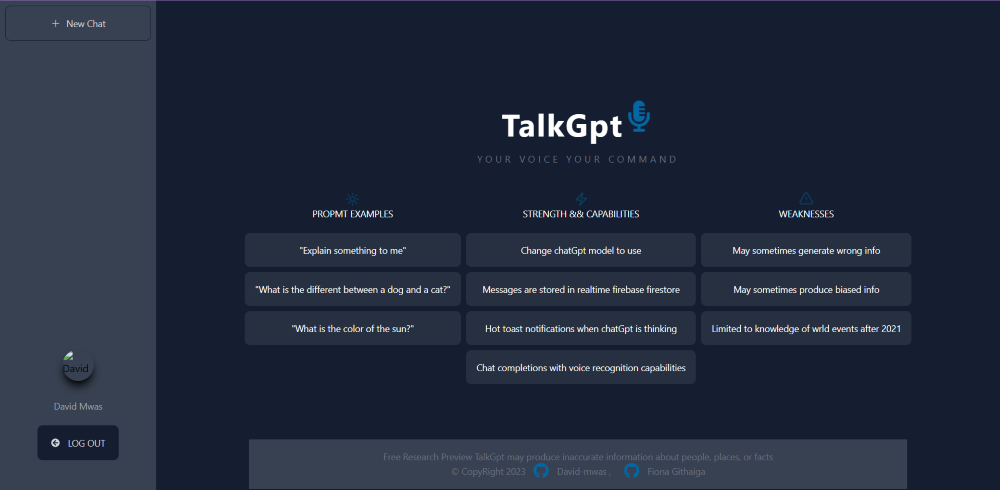
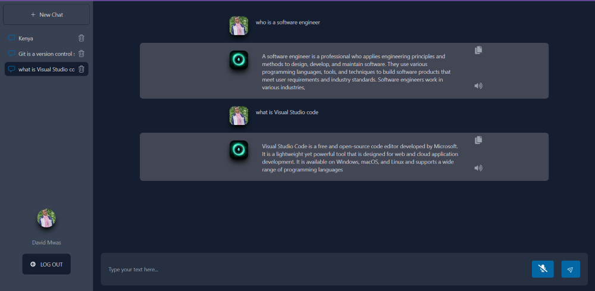

# TALKGPT-AI

Welcome to the TALKGPT Chatbot project repository! This chatbot utilizes natural language processing (NLP) technology to understand and respond to user queries and commands. It also integrates voice recognition technology, allowing users to interact with the chatbot using voice commands. The chatbot has text generation capabilities to provide informative and helpful responses to user queries.

## TALKGPT HOME PAGE


## TALKGPT CHAT PAGE


### MVP Specification

The Minimum Viable Product (MVP) for the TALKGPT Chatbot project includes the following features:

1. A chatbot that understands and responds to user queries using NLP technology.
2. Integration of voice recognition technology for interacting with the chatbot through voice commands.
3. Text generation capabilities for providing informative and helpful responses.
4. A user-friendly interface with seamless integration of voice activation and speech recognition.
5. Thorough testing to ensure correct functionality and meet user requirements.
6. The programming languages and frameworks used for development are:

- HTML/CSS (React) for the web client
- Node.js (Next.js) for the web server
- The following platforms, tools, and libraries are utilized:

### OpenAI API for NLP capabilities

1.PyAudio and React SpeechRecognition for voice recognition
2.Google Cloud Platform (GCP) for hosting
3.Dialogflow for NLP system integration
4.Firebase (firebaseDB, Auth) for real-time database updates
To mitigate technical risks, the project team employs thorough testing, continuous integration, and backup servers. For non-technical risks, effective marketing, transparent privacy policies, and regular user feedback are incorporated.

### Architecture

The following diagram illustrates the architecture of the TALKGPT Chatbot system:


### APIs and Methods

List of API routes to use for web client to communicate with web server

- /api/auth/login - This route would handle user authentication. It would accept a POST request with the user's login credentials (e.g. email and password), and if the credentials are valid, it would return a JSON Web Token (JWT) that the client can use for future authenticated requests.
- /api/auth/register - This route would handle user registration. It would accept a POST request with the user's registration information (e.g. name, email, and password), and if the information is valid, it would create a new user in the database and return a JWT.
- /chat/${doc.id} - This route would handle messages sent between users. It would accept a POST request with the message content and recipient ID, and would save the message to the database. It would also return the message ID and any relevant metadata, such as the timestamp and sender ID.
- /api/conversations - This route would handle conversations between users. It would accept a GET request with a user ID, and would return a list of all conversations involving that user, along with metadata such as the conversation ID and the names or IDs of the other participants.
- /api/conversations/:conversationId/messages - This route would handle retrieving messages for a specific conversation. It would accept a GET request with the conversation ID, and would return a list of all messages in that conversation, along with metadata such as the sender ID, timestamp, and message content.
- /api/users/:userId - This route would handle retrieving user information. It would accept a GET request with a user ID, and would return information such as the user's name, email, and any relevant metadata (e.g. number of conversations, last login time, etc.)
  List of API endpoints or function/methods that we will be creating to allow any other clients to use:
  /api/public/messages - This endpoint would allow external clients to retrieve a list of all messages in the database, regardless of which user sent or received them. It would accept a GET request, and would return a JSON array of all messages, along with metadata such as the sender and recipient IDs and the timestamp.
- /api/public/users/:userId - This endpoint would allow external clients to retrieve information about a specific user in the database. It would accept a GET request with the user ID, and would return information such as the user's name, email, and any relevant metadata.
  sendMessage(message) - This function/method would allow external clients to send a message to a specific user in the database. It would accept a message object containing the message content, sender ID, and recipient ID, and would save the message to the database.
- getConversations(userId) - This function/method would allow /api/public/messages - This endpoint would allow external clients to retrieve a list of all messages in the database, regardless of which user sent or received them. It would accept a GET request, and would return a JSON array of all messages, along with metadata such as the sender and recipient IDs and the timestamp.
- getMessagesForConversation(conversationId) - This function/method would allow external clients to retrieve all messages in a specific conversation. It would accept the conversation ID as a parameter, and would return an array of all messages in that conversation, along with metadata such as the sender ID, timestamp, and message content

#### List of 3rd party APIs

- OpenAI API: The OpenAI API is a natural language processing (NLP) API that allows developers to use state-of-the-art AI models to generate human-like text, translate languages, and perform other NLP tasks. You can use the OpenAI API in your project to generate chatbot responses based on user input, for example.
- Firebase API: You also mentioned that you will be using Firebase for storing chats and authentication. Firebase is a real-time database platform that allows developers to store and sync data in real-time across multiple clients. You can use the Firebase API in your project to perform CRUD (create, read, update, delete) operations on your Firebase database, such as creating new users or storing chat messages.
- Google Cloud Speech-to-Text API: You also mentioned that you want to use voice recognition to send chat prompts to your chatbot. You can use the Google Cloud Speech-to-Text API to convert audio input into text that can be sent to your chatbot

### Environment Setup

To run the TALKGPT Chatbot project locally, ensure you have the following software and dependencies installed:

- Node.js (version 14 or higher): Install Node.js from the official website here.

- NPM (version 6 or higher): NPM is automatically installed with Node.js.

- OpenAI API credentials: Sign up for an account on the OpenAI website and obtain your API credentials.

- Firebase account: Create a Firebase account at https://firebase.google.com and set up a new project. Note down the Firebase project ID and the necessary credentials.

- Google Cloud Platform (GCP) account: Create a GCP account at https://cloud.google.com and set up a new project. Enable the Google Cloud Speech-to-Text API and obtain the necessary API credentials.

### Dependencies

#### Frontend Dependencies:

1. React: JavaScript library for building user interfaces.
2. Next.js: Framework for server-rendered React applications.
3. React SpeechRecognition: Library for integrating speech recognition capabilities into React components.
4. TAILWINDCSS: CSS framework for creating responsive and visually appealing UI components.
5. Javascript fetch: HTTP client library for making API requests from the frontend.
6. React Router/NextJs router: Library for handling client-side routing in React applications.
   7.Next Auth: integrated with google auth provider for authentication

#### Backend Dependencies:

1.Node.js(NextJs 13): JavaScript runtime for building server-side applications.

2.OpenAI API: Library or package for interacting with the OpenAI API to access ChatGPT chatComplitions

4.React speak-kit, UseSpeechSynthesis Custom Hook: Library for audio input/output functionality required for voice recognition integration.

5.Dialogflow: Platform for building natural language understanding systems.

6.Firebase: Platform for real-time database updates, authentication, and storage.

#### Testing Dependencies:

1.Jest: JavaScript testing framework for unit testing.
2.Supertest: Library for testing HTTP endpoints.
3.React Testing Library: Testing utilities for React component

### Configuration

Create a .envlocal file in the root directory of the project and provide the following environment variables:
REACT_APP_OPENAI_API_KEY=your-openai-api-key
REACT_APP_FIREBASE_PROJECT_ID=your-firebase-project-id
REACT_APP_FIREBASE_API_KEY=your-firebase-api-key
REACT_APP_GCP_PROJECT_ID=your-gcp-project-id
REACT_APP_GCP_API_KEY=your-gcp-api-key
Replace the placeholders (your-openai-api-key, your-firebase-project-id, your-firebase-api-key, your-gcp-project-id, your-gcp-api-key) with your actual API keys and project IDs.

This is a [Next.js](https://nextjs.org/) project bootstrapped with [`create-next-app`](https://github.com/vercel/next.js/tree/canary/packages/create-next-app).

## Getting Started

First, run the development server:

```bash
npm run dev
# or
yarn dev
# or
pnpm dev
```

Open [http://localhost:3000](http://localhost:3000) with your browser to see the result.

You can start editing the page by modifying `app/page.js`. The page auto-updates as you edit the file.

This project uses [`next/font`](https://nextjs.org/docs/basic-features/font-optimization) to automatically optimize and load Inter, a custom Google Font.

## Learn More

To learn more about Next.js, take a look at the following resources:

- [Next.js Documentation](https://nextjs.org/docs) - learn about Next.js features and API.
- [Learn Next.js](https://nextjs.org/learn) - an interactive Next.js tutorial.

You can check out [the Next.js GitHub repository](https://github.com/vercel/next.js/) - your feedback and contributions are welcome!

## Deploy on Vercel

The easiest way to deploy your Next.js app is to use the [Vercel Platform](https://vercel.com/new?utm_medium=default-template&filter=next.js&utm_source=create-next-app&utm_campaign=create-next-app-readme) from the creators of Next.js.

Check out our [Next.js deployment documentation](https://nextjs.org/docs/deployment) for more details.

# TalkGptv1
